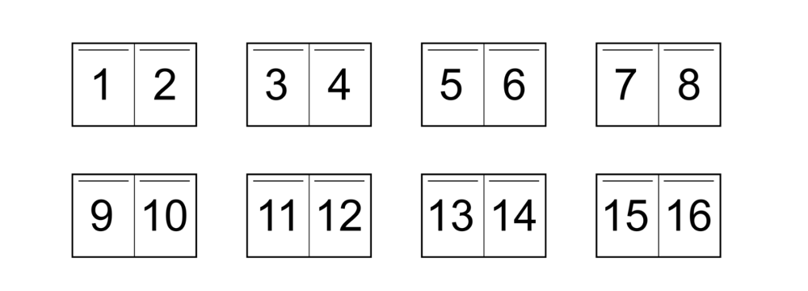

# Imposition pour des petites éditions

L'imposition est un terme d'imprimerie. L'opération consiste à placer plusieurs pages d'un ouvrage sur une grande feuille afin d'obtenir un cahier lors du pliage. (cf. [définition wikipedia](https://fr.wikipedia.org/wiki/Imposition_(imprimerie))

## Brochure A5 de 16 pages vers A5, A6, A7

Passer d'une brochure A5 dont les pages se suivent à différentes impositions pour produire une version imprimable au format A5, A6 ou A7 qui respecte les cahiers.  

Des petits dessins pour rendre tout ça plus clair :

**Brochure originale en A5**

**Imposition en A5 sur 4 feuillets**

script bash : [16_pages_montage_version_imprimable_a5.sh](./brochure_a5_16_pages_vers_a5_a6_a7/16_pages_montage_version_imprimable_a5.sh)  
à imprimer en format paysage, recto-verso, bords courts

**Imposition en A6 sur 2 feuillets**

script bash :[16_pages_montage_version_imprimable_a6.sh](./brochure_a5_16_pages_vers_a5_a6_a7/ 16_pages_montage_version_imprimable_a6.sh)  
à imprimer en format portrait, recto-verso, bords longs

**Imposition en A7 sur 1 feuillet**

script bash : [16_pages_montage_version_imprimable_a7.sh](./brochure_a5_16_pages_vers_a5_a6_a7/16_pages_montage_version_imprimable_a7.sh)   
à imprimer en format paysage, recto-verso, bords courts.  
Faire bien attention pour le pliage!

## Quelques valeurs utiles

A4 paysage @ 300 DPI : 3496 x 2480 (à quelques pixels près, les calculs donnent 3508 x 2480 mais les logiciels diffèrent)  
A4 portrait : 210 x 297 mm  
A3 paysage : 420 x 297 mm  
A5 : 148 x 210 mm @ 300 DPI : 1748x2480 / @ 150 DPI 874 x 1240 / @ 100 DPI 582 x 827  
